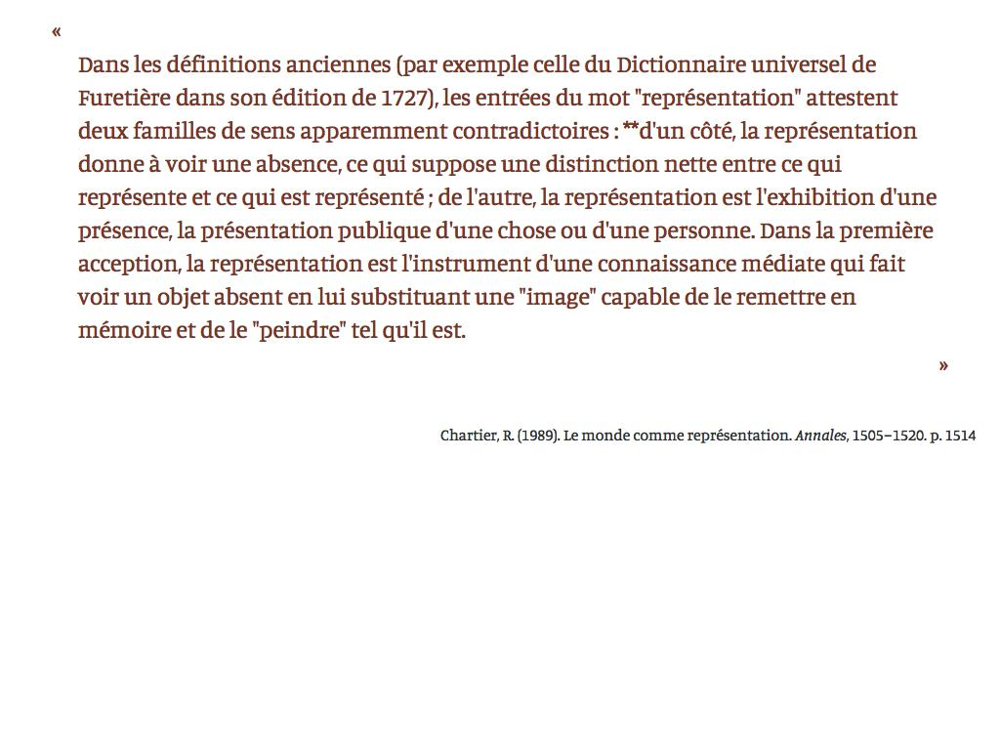

PhBot
===

PhBot daily publishes quotes on twitter based on academic books readings.

Quotes look like that :



# Before installation

First your need your quotes. Your data should look like [this](https://docs.google.com/spreadsheets/d/1Ail_0sdlY-8BRuVwcoaob7TmLR4KTS3yQ7euOdXKUt4/edit?usp=sharing). Column names must be the same (or you must change that in the code in the `scripts/parseCitations` script).
Please notice there are two tabs which must correspond to two different tables: first is the one of quotes themselves, second is a collection of **bibTeX**-formatted citations to consume in order to display quotes source citations properly.

Once you have your citations in the table export them as csv (comma-separated values) and replace `quotes.csv` & `references.csv`.

Then you need to [setup a new twitter app](https://apps.twitter.com/) in order to access the API.

You will also need to have [phantomjs](http://phantomjs.org/) installed.

You're set !

# Installation

```
git clone https://github.com/robindemourat/PhDBot
cd PHDBot
npm install
cp secrets.sample.json secrets.json
# Fill secrets.json with your data
```

# Deployment to heroku

Before deploying make sure your contents are updated with your own quotes :

```
npm run build
```

First create your project on heroku.

Then delete the git record of the project and create the new one.

```
rm -rf .git
git init
git add .
git commit -m "first commit"
heroku push origin master
```

Then I setup a bash script that does everything to properly set the app on the distant server. First you have to set your data:

```
cp heroku.sample.sh heroku.sh
# Fill heroku.sh with your data (twitter credentials + app name)
```

Then you can launch the script:

```
# give permission
chmod u+rw heroku.sh
# let's roll
./heroku.sh
```

At the end of its execution the script opens the page of the `heroku scheduler` add-on. You will have to :
* click on "add a new job"
* in the command input: `node bin/recron`
* set the UTC date corresponding to the moment in the day when to publish new citations